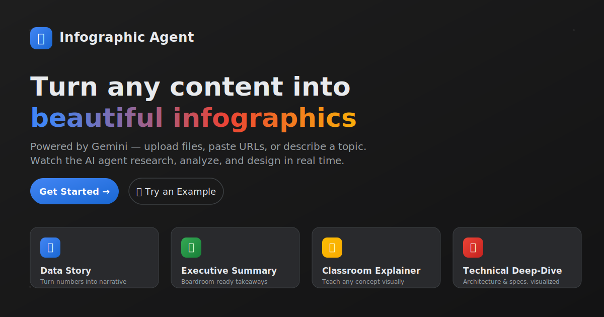
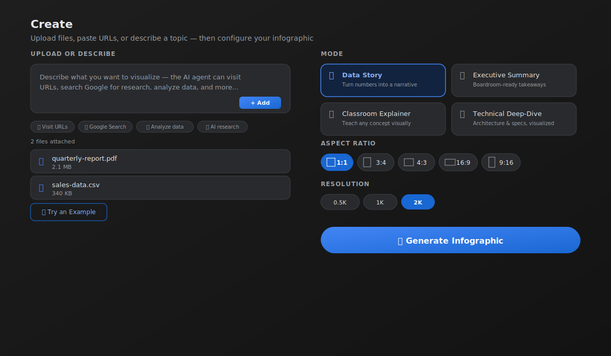
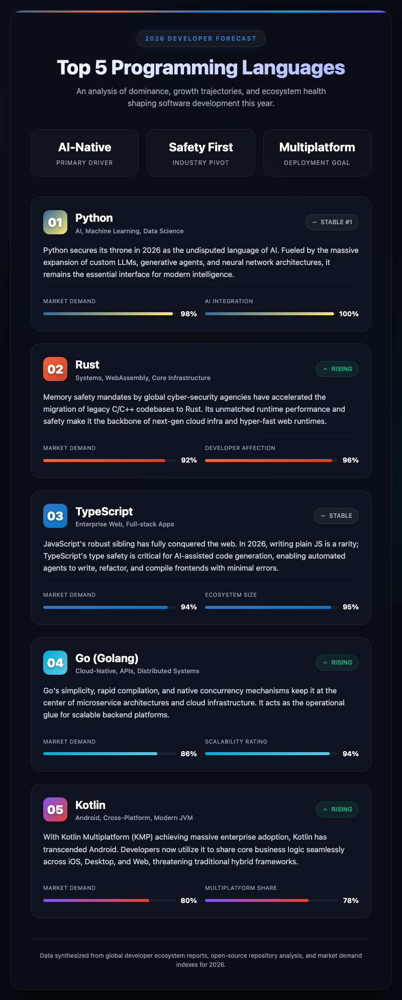
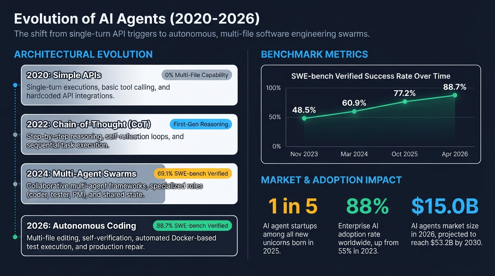
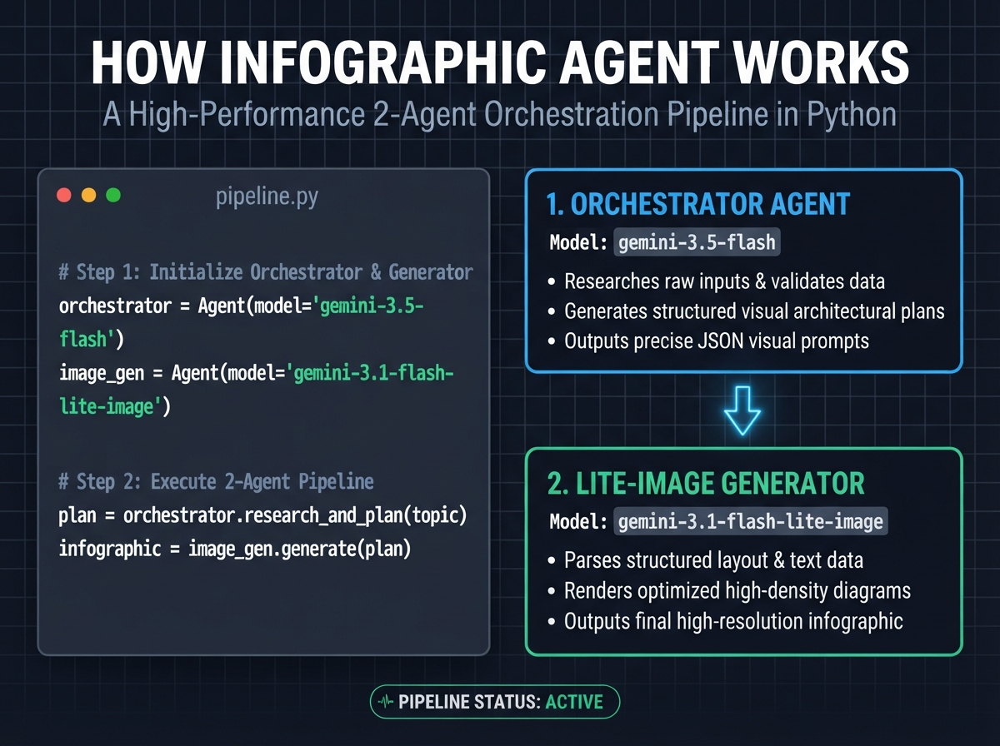
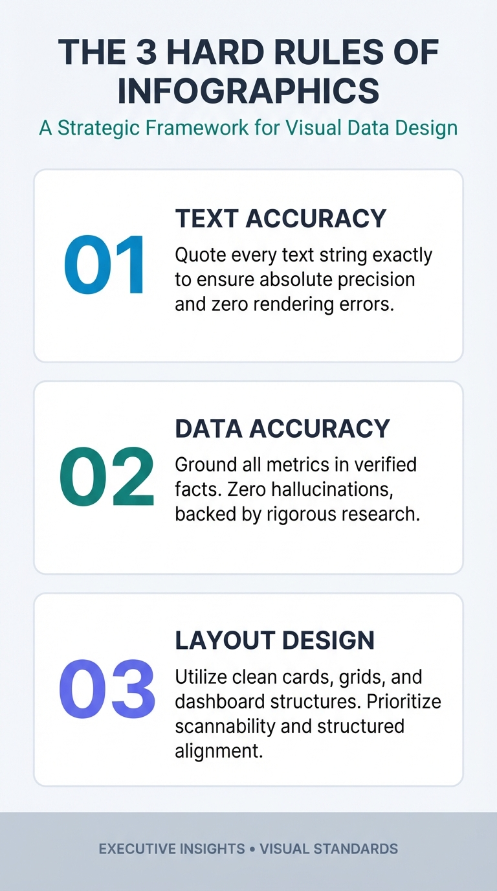

<div align="center">



### Turn any content into beautiful infographics

Upload a PDF, paste a URL, or just describe a topic — a two-agent Gemini pipeline researches, designs, and renders a polished infographic in real time, right in your browser.

[](https://github.com/ryanbaumann/infographic-agent/actions/workflows/ci.yml)
[](https://github.com/ryanbaumann/infographic-agent/actions/workflows/playwright.yml)
[](LICENSE)

---

### 🚀 Get Started Immediately

| **Web App** (In the Browser) | **Portable Skill** (In the Terminal / Coding Agent) |
| :--- | :--- |
| [Try the Live Demo](https://infographic-agent-gajikud3na-uc.a.run.app) | `npx skills add ryanbaumann/infographic-agent` *(Install into Agent)*<br>`npx infographic-agent "your topic"` *(Run directly)* |

---

</div>

## Features

- **Multi-format input** — PDF, CSV/spreadsheets, images (PNG/JPEG/WebP/HEIC), plain text, or just a topic description
- **6 infographic modes** — Data Story, Executive Summary, Classroom Explainer, Technical Deep-Dive, Quick Slide, and fully Custom
- **Configurable output** — 6 aspect ratios (square, portrait, landscape, and more) and resolution from 0.5K up to 2K
- **Live "thought" stream** — watch the agent's reasoning render as streaming cards while it researches and designs
- **Multi-turn refinement chat** — keep talking to the agent to tweak colors, layout, or content after the first draft
- **Before/after slider** — compare each revision against the original at a glance
- **Local history** — past generations are cached in IndexedDB so you can pick up where you left off
- **Dark / light theme**, and one-click **PNG download** of the final result

## Quick Start

**Prerequisites:** Node.js 18+ and a free [Gemini API key](https://aistudio.google.com/apikey)

```bash
git clone https://github.com/ryanbaumann/infographic-agent.git
cd infographic-agent
npm install
cp .env.example .env
# add your Gemini API key to .env, or paste it into the app's settings panel at runtime
npm run dev
```

This opens `/app.html` on `http://localhost:3456`.

| Script | What it does |
|---|---|
| `npm run dev` | Start the Vite dev server |
| `npm run build` | Type-check and build a single self-contained `dist/index.html` |
| `npm run lint` | Run ESLint |
| `npm test` | Run Vitest unit tests once |
| `npm run test:coverage` | Unit tests with coverage report |
| `npm run test:e2e` | Run the Playwright end-to-end suite (auto-starts the dev server) |

## How It Works



Generation runs as a small two-agent pipeline, both powered by Gemini:

1. **Analysis agent** (`gemini-3.5-flash`) reads your files/URLs/prompt, optionally searches the web, and produces a structured Prepare result — analysis metadata, exact text strings, key data points, and a renderer prompt.
2. **Eval gate** checks the Prepare result for schema, explicit image prompt prefix, quoted text strings, source attribution, accessibility guidance, and prompt length before rendering.
3. **Image agent** (`gemini-3.1-flash-lite-image`) turns the validated prompt into a rendered infographic, streaming its design "thoughts" back to the UI as it works.

After the first draft, the **refinement chat** lets you send follow-up instructions ("make the header bolder", "use our brand colors") — each turn re-invokes the image agent with the conversation history, and the before/after slider shows what changed.

See [`docs/architecture.md`](docs/architecture.md) for the full technical deep-dive (prompt design, streaming protocol, state management).

## The Portable Skill

Prefer working from a coding agent instead of the browser? The [`skill/infographic-agent/`](file:///Users/ryanbaumann/projects/infographic-agent/skill/infographic-agent/) directory packages the **same two-agent pipeline** as a standalone, agent-agnostic **skill** — a [`SKILL.md`](file:///Users/ryanbaumann/projects/infographic-agent/skill/infographic-agent/SKILL.md) configuration plus a [`portable_infographic.py`](file:///Users/ryanbaumann/projects/infographic-agent/skill/infographic-agent/portable_infographic.py) script. Any AI coding agent with skill/tool support can invoke this to generate an infographic PNG directly from the command line, no web app required. It uses `gemini-3.5-flash` to research and engineer the prompt, then `gemini-3.1-flash-lite-image` to render it.

**No browser, Playwright, or Chromium download** — install is a single `pip install google-genai pillow` (Google's GenAI SDK runs the pipeline; Pillow transcodes the output to lossless PNG for crisp text).

The skill is also published on npm as `infographic-agent` and works with the [Vercel agent skills ecosystem](https://github.com/vercel-labs/skills), so you can run it anywhere with a single command. The CLI mirrors the web loop: Prepare, deterministic eval, Render, Review, and optional Refine.

**Install into your AI coding agent** (Claude Code, Cursor, Copilot, etc.):
```bash
npx skills add ryanbaumann/infographic-agent
```

### Installation & Setup

Before running the CLI tool for the first time, you must install the required Python dependencies (`google-genai` and `pillow`). You can do this automatically via `npx` or manually with `pip`:

```bash
# Automated install via npx (Node.js required)
npx infographic-agent --install

# Manual install via pip
pip install google-genai pillow
```

### CLI Flags & Options

The CLI options and flags are shared between the `npx infographic-agent` command and the direct Python script invocation (`python3 skill/infographic-agent/portable_infographic.py`).

| Flag / Option | Short | Description | Default / Choices |
| :--- | :--- | :--- | :--- |
| `topic` | *None* | **Positional argument**. The topic, prompt, or content you want to visualize. | *None* |
| `--text` | *None* | Alternative to the positional `topic` argument (useful for piping or long multiline content). | *None* |
| `--output` | `-o` | File path where the output PNG will be saved. | `infographic.png` |
| `--mode` | `-m` | Preset layout and style theme for the infographic. | `data-story`<br>Choices: `classroom`, `custom`, `data-story`, `executive-summary`, `quick-slide`, `technical-deep-dive` |
| `--aspect` | `-a` | Aspect ratio of the generated infographic image. | `9:16`<br>Choices: `1:1`, `1:4`, `3:4`, `4:3`, `9:16`, `16:9` |
| `--instructions` | `-i` | Custom layout, design, or style rules (e.g. brand hex colors, font preferences). | `""` |
| `--image-model` | *None* | Image model for the portable skill. The web app remains locked to `gemini-3.1-flash-lite-image`. | `gemini-3.1-flash-lite-image`<br>Choices: `gemini-3.1-flash-lite-image`, `gemini-3.1-flash-image` |
| `--no-research` | *None* | Skip the research agent and generate directly from your text (faster, doesn't use Google Search). | *Flag* |
| `--no-open` | *None* | Do not auto-open the generated infographic image in the default system viewer. | *Flag* |
| `--yes` | `-y` | Non-interactive execution. Generates once and exits immediately without entering the refine loop. | *Flag* (best for CI or autonomous agents) |
| `--setup` | *None* | Launch the interactive key onboarding walkthrough to configure your Gemini API key, then exit. | *Flag* |
| `--install` | *None* | Installs Python packages `google-genai` and `pillow`. | *Flag* (supported only via npm wrapper) |
| `--help` | `-h` | Display the CLI help documentation and exit. | *Flag* |

#### Infographic Modes Description
*   **`data-story`**: Data-forward layout with charts, graphs, statistical callouts, trend lines, and percentage highlights.
*   **`executive-summary`**: Clean and minimal. Large headline numbers, 3-5 key takeaways, strategic insights, board-ready aesthetics.
*   **`technical-deep-dive`**: Dense and precise. Architecture diagrams, code snippets in monospace, system-flow arrows, technical terminology.
*   **`classroom`**: Friendly and illustrative. Numbered steps, visual analogies, approachable language, warm colors.
*   **`quick-slide`**: Single-slide format with minimal text, high visual impact, presentation-ready large typography.
*   **`custom`**: Fully custom layout tailored directly by your additional instructions.

### Environment Variables

If an API key is not configured, the CLI will guide you through an interactive setup and store the key in `~/.config/infographic-agent/config.json`. Alternatively, you can use the following environment variables:

| Variable | Description |
| :--- | :--- |
| `GEMINI_API_KEY` | Your Gemini API key. Get a free one at [Google AI Studio](https://aistudio.google.com/apikey). |
| `GOOGLE_API_KEY` | Alternative environment variable for the Gemini API key. |
| `GOOGLE_CLOUD_PROJECT` | Setting this activates Vertex AI mode (use in Google Cloud environments instead of an API key). |
| `GOOGLE_CLOUD_LOCATION` | Vertex AI region/location (default: `us-central1`). |
| `XDG_CONFIG_HOME` | Custom configuration directory path (defaults to `~/.config`). |

### Usage Examples

#### 1. Basic Generation with Onboarding
If no key is configured in your environment or saved config, this command opens a browser tab for you to grab a free key from Google AI Studio, saves it locally, and generates the infographic.
```bash
npx infographic-agent "Top 5 programming languages in 2026"
```

#### 2. One-shot Generation (For CI / Coding Agents)
Using `--yes` runs the generator end-to-end and exits. This prevents the CLI from blocking on the interactive refinement loop, which is ideal for automation.
```bash
export GEMINI_API_KEY="your-key"
npx infographic-agent "Q2 sales highlights" -o sales.png -m executive-summary --yes
```

#### 3. Customizing Layout & Aspect Ratio
Generate a landscape (16:9) technical diagram with custom color preferences:
```bash
npx infographic-agent "Microservices Architecture" \
  --output arch.png \
  --mode technical-deep-dive \
  --aspect 16:9 \
  --instructions "Use a cool dark color scheme with dark blue, teal, and slate gray"
```

#### 4. Inline Text / Piped Input
Pass long or dynamically generated text directly:
```bash
# Using --text argument
npx infographic-agent --text "$(cat release_notes.txt)" -o release.png

# Direct python script execution
python3 skill/infographic-agent/portable_infographic.py --text "$(cat release_notes.txt)"
```

#### 5. Interactive Refinement
If you run without `--yes` (in an interactive terminal), you will enter a live **refine loop** after the first draft is created. You can iteratively tweak the design by typing comments:
```bash
Refine › make the header bolder
Refine › use teal accents
Refine › exit
```
Each iteration will save a new version (`infographic-v2.png`, `infographic-v3.png`, etc.) and automatically open it for preview.

Here is an example infographic generated using this skill for the prompt *"Top 5 programming languages in 2026"*:

<div align="center">
  
</div>

## Gallery of Generated Infographics

Below is a gallery of sample infographics generated using the portable CLI tool with different aspect ratios and modes.

### 🤖 Evolution of AI Agents (2020-2026)

*   **Style Mode:** `data-story`
*   **Aspect Ratio:** `16:9` (Landscape)

**CLI Command:**
```bash
python3 skill/infographic-agent/portable_infographic.py \
  "Evolution of AI Agents (2020-2026): In 2020, simple APIs were used. In 2022, chain-of-thought emerged. In 2024, multi-agent frameworks took off. By 2026, autonomous coding agents do multi-file editing and verification." \
  --output examples/ai_agents_evolution.png \
  --mode data-story \
  --aspect 16:9 \
  --yes \
  --no-open
```

<div align="center">
  
</div>

---

### ⚙️ How Infographic Agent Works

*   **Style Mode:** `technical-deep-dive`
*   **Aspect Ratio:** `4:3` (Standard Landscape)

**CLI Command:**
```bash
python3 skill/infographic-agent/portable_infographic.py \
  "How Infographic Agent Works: A 2-agent pipeline in Python. Orchestrator model (gemini-3.5-flash) researches and plans, then Lite-Image model (gemini-3.1-flash-lite-image) generates." \
  --output examples/how_it_works.png \
  --mode technical-deep-dive \
  --aspect 4:3 \
  --yes \
  --no-open
```

<div align="center">
  
</div>

---

### 📋 The 3 Hard Rules of Infographics

*   **Style Mode:** `executive-summary`
*   **Aspect Ratio:** `9:16` (Tall Portrait)

**CLI Command:**
```bash
python3 skill/infographic-agent/portable_infographic.py \
  "The 3 Hard Rules of Infographics: 1. Text Accuracy (quote every text string exactly), 2. Data Accuracy (no hallucinations, ground with search), 3. Layout Complexity (use clean cards/dashboards/grids)." \
  --output examples/infographic_rules.png \
  --mode executive-summary \
  --aspect 9:16 \
  --yes \
  --no-open
```

<div align="center">
  
</div>


## Deployment

**Docker:**

```bash
docker build -t infographic-agent .
docker run -p 8080:8080 infographic-agent
```

**Docker Compose:**

```bash
docker-compose up --build
```

Both serve the built app via nginx on `http://localhost:8080`.

**Google Cloud Run:** [`cloudbuild.yaml`](cloudbuild.yaml) builds the image, pushes it to Container Registry, and deploys it to Cloud Run — wire it up with `gcloud builds submit` or a Cloud Build trigger.

Because the build output is a single `dist/index.html` with all JS inlined (via `vite-plugin-singlefile`), you can also drop it onto any static host (Cloud Storage, S3, GitHub Pages, nginx, etc.) with no server-side runtime at all. Two caveats:

- **Never build a public artifact with a real key in `.env`** — Vite inlines `VITE_GEMINI_API_KEY` into `dist/index.html` in plaintext. Public deployments should ship key-less; visitors add their own key in the settings panel.
- The page loads Tailwind's Play CDN and Google Fonts at runtime, so browsers need outbound access to `cdn.tailwindcss.com`, `fonts.googleapis.com`, and `fonts.gstatic.com` (it is not fully offline/air-gap friendly).

## Testing

- **Unit tests** (Vitest + Testing Library): `npm test`
- **End-to-end tests** (Playwright): `npm run test:e2e` — covers smoke, generation, refinement, mobile, and error-handling flows in `tests/`
- Both suites run in CI on every push/PR to `main` (see badges above)

## Security

API keys are **user-provided and client-side by design** — there's no backend to leak them from, and the app ships as a static SPA. Uploads are validated against a MIME whitelist and magic-byte signatures before processing, and a strict Content-Security-Policy locks down script/style/connect sources. Full details and the responsible-disclosure process are in [`SECURITY.md`](SECURITY.md).

## Contributing

Contributions are welcome, from humans and AI agents alike. Start with [`CONTRIBUTING.md`](CONTRIBUTING.md) for setup and workflow, and if you're an AI coding agent working in this repo, read [`AGENTS.md`](AGENTS.md) first — it has the project map, conventions, and a verification checklist this repo expects agents to follow.

## License

[MIT](LICENSE) © Ryan Baumann

## Project Structure

```
infographic-agent/
├── app.html                  # Vite entry point (not index.html)
├── src/
│   ├── App.tsx                # Top-level step router (hero → create → studio)
│   ├── main.tsx
│   ├── types.ts                # Shared types, config defaults, limits
│   ├── components/             # StepHero, StepCreate, StepStudio, ChatPanel,
│   │                           # ThoughtStream, BeforeAfterSlider, ThemeToggle, AdminPanel
│   ├── hooks/                  # useInfographicFlow (core state machine), useBlobUrl
│   ├── services/                # geminiService, fileProcessor, downloadService
│   └── __tests__/               # Vitest unit tests + fixtures
├── tests/                     # Playwright e2e specs
├── skill/infographic-agent/  # Portable, agent-agnostic CLI skill
├── docs/
│   ├── architecture.md         # 2-agent pipeline deep-dive
│   ├── learnings.md             # Engineering notes from development
│   └── assets/                  # README images
├── Dockerfile, docker-compose.yml, cloudbuild.yaml, nginx.conf
├── AGENTS.md, CONTRIBUTING.md, SECURITY.md, LICENSE, CHANGELOG.md
└── .github/workflows/          # ci.yml, playwright.yml
```

## Troubleshooting

- **App keeps asking for an API key** — get a free one at [aistudio.google.com/apikey](https://aistudio.google.com/apikey) and either put it in `.env` as `VITE_GEMINI_API_KEY` (dev) or paste it into the settings panel (it's stored in your browser only).
- **"File exceeds maximum size" / files silently skipped** — individual files are capped at 20MB, 50MB total per generation, up to 14 files; split large PDFs or compress images.
- **Generation feels slow** — the analysis agent may search the web or read large files before the image agent starts rendering; watch the thought stream, it's usually still working, not stuck. Use 0.5K or 1K for faster web-app iteration, then upgrade to 2K when the layout is approved.
- **`npm run dev` prints `spawn xdg-open ENOENT`** — harmless in headless environments (SSH, containers, CI): the server is running fine, there's just no browser to auto-open. Visit `http://localhost:3456` yourself.
